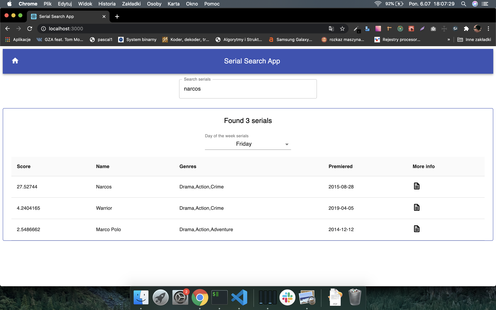
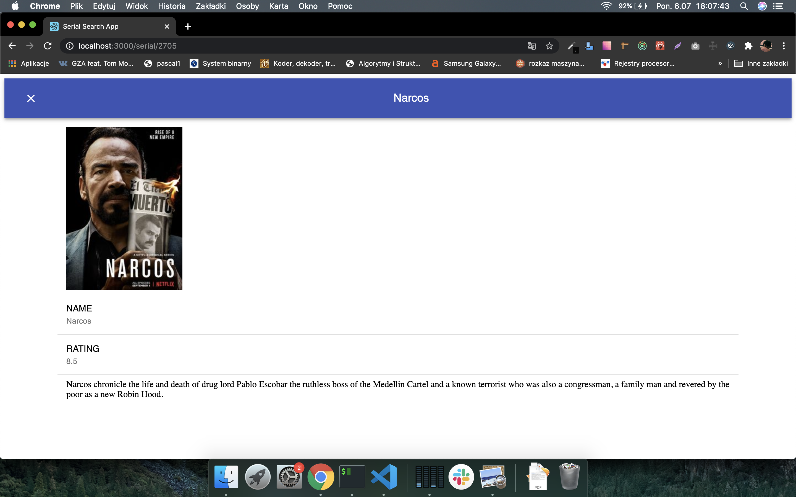
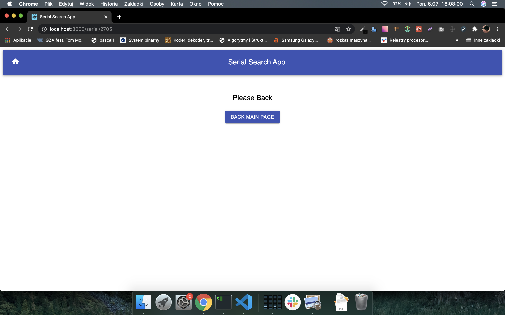

## Serial Search App

In the project directory, you can run and download packages:

### `npm install`

### `npm start`

## Project use:

- MATERIAL-UI
- REDUX
- REDUX-THUNK
- REACT-ROUTER

### Main view

### Serial View

### Error View

